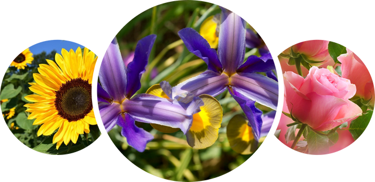

# Starting kit for Living Species Classification Challenge

This challenge uses a Dataset introduced by Maria-Elena Nilsback and Andrew Zissermanfor in the paper **Automated  flower  classification  over  a  large number  of  classes**,  
 
 
The dataset consists of a total of 8,189 images belonging to 102 classes that  are  commonly  occuring  in  the  United  Kingdom. Some of the classes are the following:

1. Buttercup
2. Fire lily
3. Azalea
4. Gaura
5. Garzania

    
This challenge is about creating and predicting a Machine Learning model and train it with the data provided to be able to identify and classify living species.

### Phases
This challenge consists of three phases:  

1. `Phase 0`: 
Public phase. We provide you with Dataset0 containing labeled data. You will not be evaluated on this dataset, but it will be used to develop the model that you will then submit for other 2 phases.

1. `Phase 1`
Development phase. This time you do not have access to any part of the Dataset1 which will be used to train and test on the model you submitted. The performance of your LAST submission on the test set will be displayed on the leaderboard.

2. `Phase 2`
Final phase. This will follow the same procedure as phase 1 but with the Dataset2. And you will only have a single submission to assess your final performance on the challenge.
Your performance on the test set will appear on the leaderboard when the organizers finish checking the submissions ensuring there is no cheating involved. 
    
    

### References and credits: 

 
1. Automated  flower  classificationover  a  large  number  of  classes (https://www.robots.ox.ac.uk/~vgg/publications/2008/Nilsback08/nilsback08.pdf)       
2. Université Paris Saclay (https://www.universite-paris-saclay.fr/)
3. ChaLearn (http://www.chalearn.org/)

### Prerequisites:
Install Anaconda Python 3.6.6 

### Usage:

(1) If you are a challenge participant:

- The file README.ipynb contains step-by-step instructions on how to create a sample submission for the PACHAMAMA Image Classification challenge. 
At the prompt type:
`jupyter-notebook README.ipynb`

- modify sample_code_submission to provide a better model or you can also write your own model in the jupyter notebook.

- zip the contents of sample_code_submission (without the directory, but with metadata), or

- download the public_data and run (double check you are running the correct version of python):

  `python ingestion_program/ingestion.py public_data sample_result_submission ingestion_program sample_code_submission`

then zip the contents of sample_result_submission (without the directory).

(2) If you are a challenge organizer and use this starting kit as a template, ensure that:

- you modify README.ipynb to provide a good introduction to the problem and good data visualization

- sample_data is a small data subset carved out the challenge TRAINING data, for practice purposes only (do not compromise real validation or test data)
